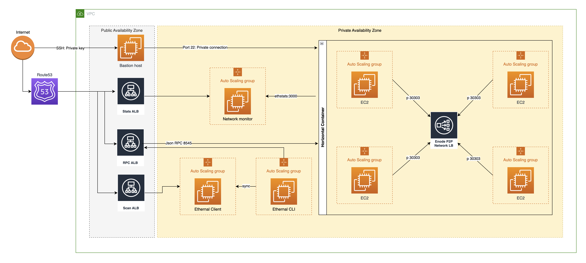
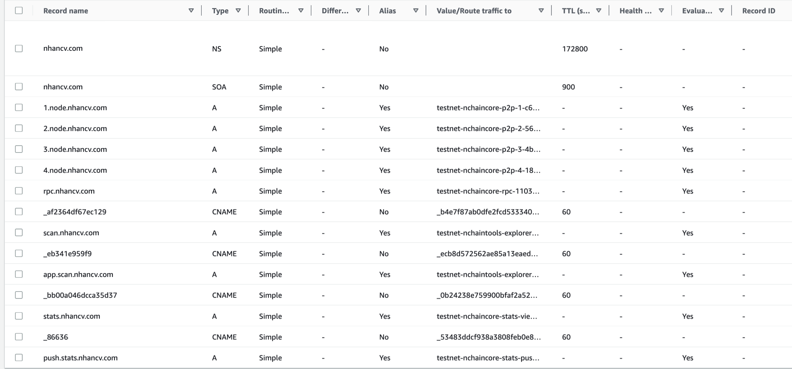
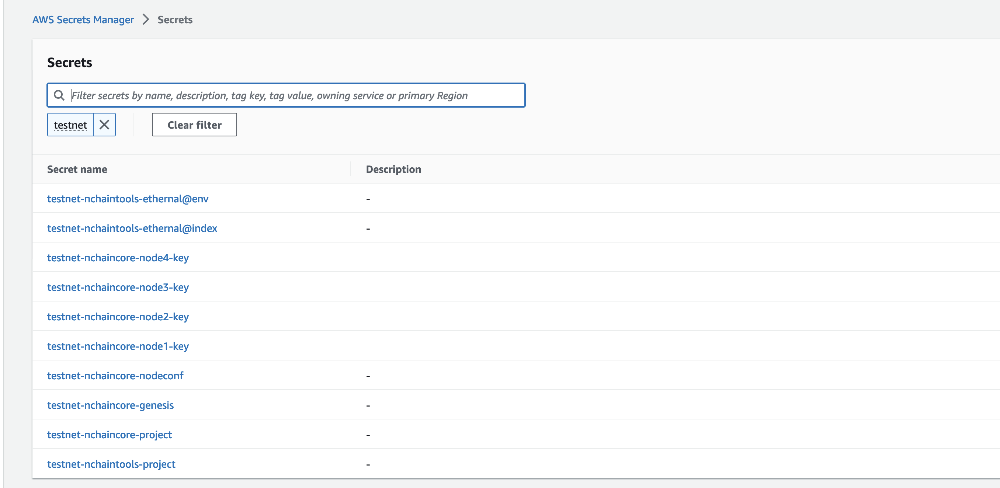
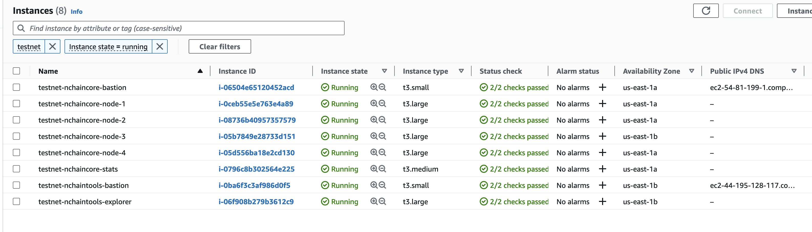
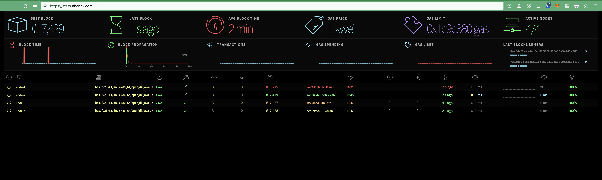
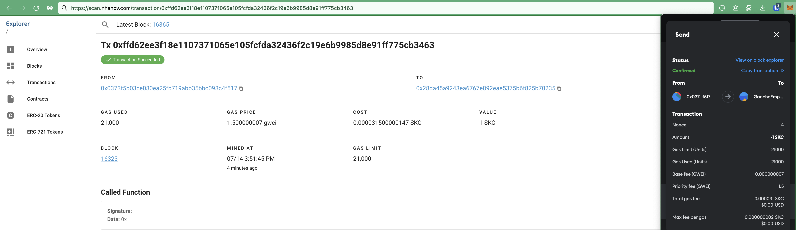
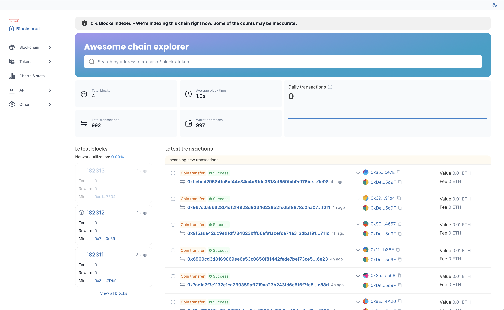
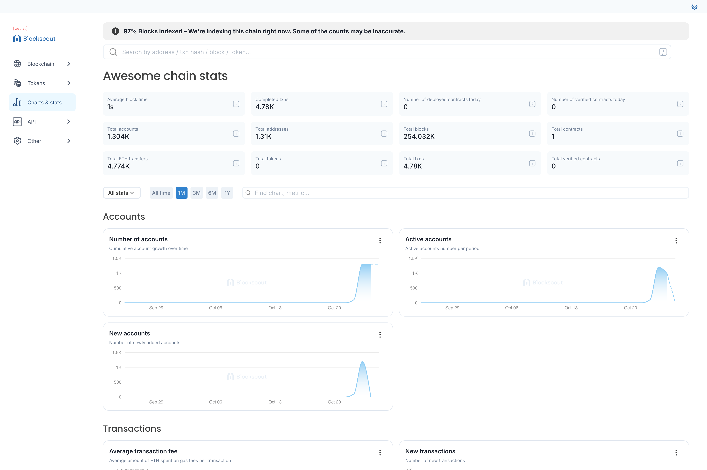

# nchain.poa

Deploy IBFT Ethereum Private Network with Hyperledger Besu, Ethstats, Ethernal, Blockscout to AWS Cloud via Terraform

## Network configuration
- Ethereum Client: Besu
- Ethereum Stats: Ethstats
- Ethereum Explorer: Ethernal & Blockscout
- Consensus: IBFT2.0
- Deploy environment: AWS Cloud via Terraform
- Gas price: 1000 Wei (0.000001 GWei) (default)
- Gas limit: 30M
- Ethereum client: besu
- Block time: 1s (minimum)
- Block size: ~1KB

### Hardware recommendation for testing
- AWS instance type: >= t3.medium
- Processor: x86-64 bit 2-4+ cores
- Memory: 4-8 GB
- Storage:  50-100GB
- Operating System: Linux (Ubuntu 20.04)

### Calculate minimum DISK Size Growing
- Basic transfer native coin (ETH) is a fixed cost of **21,000 gas**
- An ETH transfer transaction typically uses **about 109 bytes** of data. Here’s a breakdown of how these bytes are used:
  1. **Nonce (8 bytes)**: Unique identifier for the transaction from a specific sender to prevent double-spending and to keep transactions in order.
  2. **Gas Price (16 bytes)**: The amount of ETH the sender is willing to pay per unit of gas.
  3. **Gas Limit (8 bytes)**: The maximum amount of gas the sender allows for this transaction (for an ETH transfer, this is set to 21,000).
  4. **To Address (20 bytes)**: The recipient’s address.
  5. **Value (32 bytes)**: The amount of ETH to transfer, stored as a 256-bit value.
  6. **Data (0 bytes)**: Since an ETH transfer is a simple transaction, it does not include additional data.
  7. **V, R, S (65 bytes total)**: The cryptographic signature fields used to validate the transaction, which include recovery id (V), and the signature (R and S values).
- Assume 1 tx in a block ⇒ Block size:
  - Block Header: 500 - 600 bytes
  - Transaction Data: 109 bytes for basic transfer
  - Transaction Receipt: 80 - 100 bytes for basic transfer
  - Total: 600+109+100=809 bytes ~ 1KB ceil rounded
- **Estimation for 10 years:**
  - Total blocks in 10 years (Block time = 1 second): 10 * 365 * 24 * 60 * 60 = 315,360,000 blocks
  - Minimum total size = 1 KB * 315360000 = 315.4 GB

## Requirements

- AWS account. Increase the limit of EC2 instances to 32 at http://aws.amazon.com/contact-us/ec2-request
- Domain: Namecheap -> Point DNS Nameservers to AWS Route 53. Ex: `nhancv.com`
- Terraform account

## Setup Blockchain 

- Network Core & Stats monitor: [network_core/README.md](./network_core/README.md)
- Blockchain Explorer with Ethernal and Blockscout: [network_tools/README.md](./network_tools/README.md)
- AWS cost estimation: `~$32/day` for full services and `~$21/day` without Ethernal and Ethstats 

## Demo

- AWS Route 53:
  

- AWS Secret Manager:
  

- AWS EC2 Instances:
  

- Stastics: https://stats.nhancv.com
  

- Ethernal explorer: https://scan.nhancv.com
  
  

- Blockscout explorer: https://blockscout.nhancv.com
  
  

## Others

- EVM Chain CometBFT PoS with Evmos: https://github.com/nhancv/nchain.pos