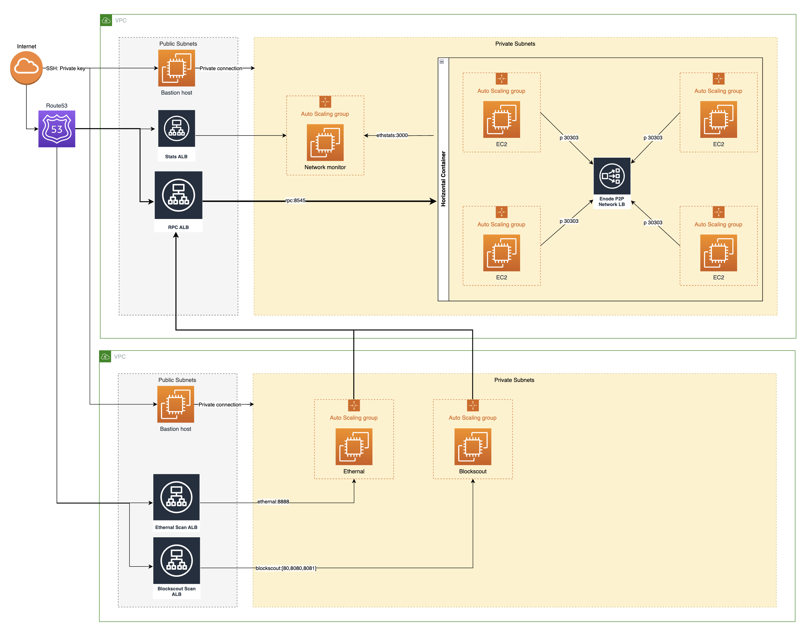
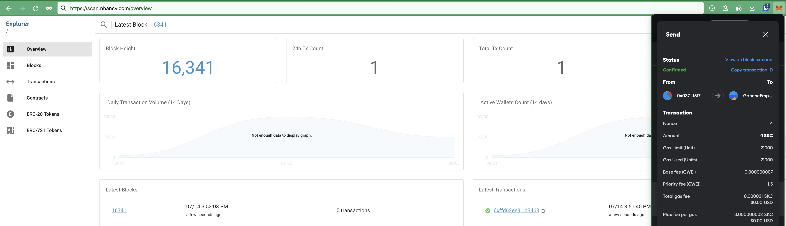
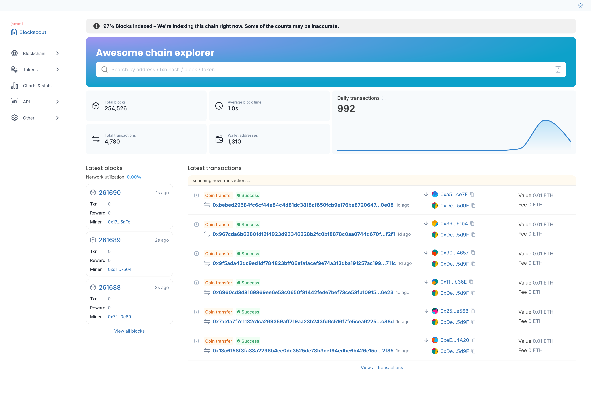

# N Chain

Deploy IBFT Ethereum Private Network with Hyperledger Besu, Ethstats, Ethernal, Blockscout to AWS Cloud via Terraform

## Network configuration
- Ethereum Client: Besu
- Ethereum Stats: Ethstats
- Ethereum Explorer: Ethernal & Blockscout
- Concensus: IBFT2.0
- Deploy environment: AWS Cloud via Terraform
- Gas price: 1000 Wei (0.000001 GWei) (default)
- Gas limit: 30M
- Ethereum client: besu
- Block time: 1s (minimum)
- Block size: ~0.6KB

### Hardware recommendation
- AWS instance type: >= t3.medium
- Processor: x86-64 bit 2-4+ cores
- Memory: 4-8 GB
- Storage:  50-100GB
- Operating System: Linux (Ubuntu 20.04)

## Requirements

- AWS account. Increase the limit of EC2 instances to 32 at http://aws.amazon.com/contact-us/ec2-request
- Domain: Namecheap -> Point DNS Nameservers to AWS Route 53. Ex: `nhancv.com`
- Terraform account

## Setup Blockchain Network Core & Stats monitor

- 102 resources estimated cost: $450
- Read more at [network_core/README.md](./network_core/README.md)

## Setup Blockchain Explorer with Ethernal and Blockscout

- 46 resources estimated cost: $140
- Read more at [network_tools/README.md](./network_tools/README.md)

## Demo

- AWS Route 53:
  

- AWS Secret Manager:
  

- AWS EC2 Instances:
  

- Stastics: https://stats.nhancv.com
  

- Ethernal explorer: https://scan.nhancv.com
  
  

- Blockscout explorer: https://blockscout.nhancv.com
  
  